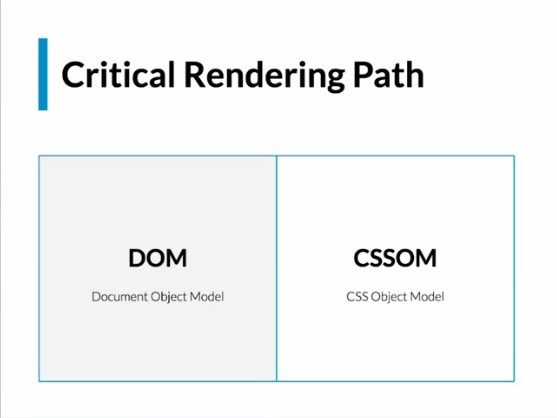

# CRP - CRITICAL RENDER PATH

## RENDER TREE - ÁRBOL DE RENDERIZADO

    El DOM es una representación del HTML en una estructura en forma de árbol de nodos
    El CSSOM es una representación de los estilos en una estructura en forma de árbol de nodos

## WEB API's
    Existen muchas web api's desarrolladas para diferenbtes propósitos como:
        - Animaciones
        - Drag and Drop
        - Transmisiones de video con RTC
        - EventListener en el caso de eventos para JS
        - etc

    En la siguiente página se muestra las api según MDN;
    [https://developer.mozilla.org/es/docs/web/api]

## LECTURA DE NODOS
    - Obtener un elemento por su ID:
    - document.getElementById('id')

    - Obtener elementos mediante el nombre de la etiqueta:
    - document.getElementsByTagName('tagName')

    - Obtener elementos mediante el nombre de clase:
    - document.getElementsByClassName('className')

    - Selecciona un solo elemento y lo devuelve, la selección se hace a través de lo que
      le pases entre paréntesis, y la selección puede ser con sintaxis de CSS
    - document.querySelector()

    - Obtener varios elementos
    - document.querySelectorAll()