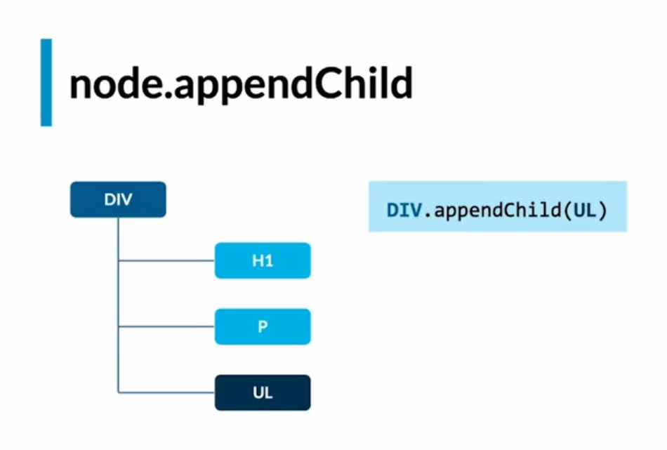
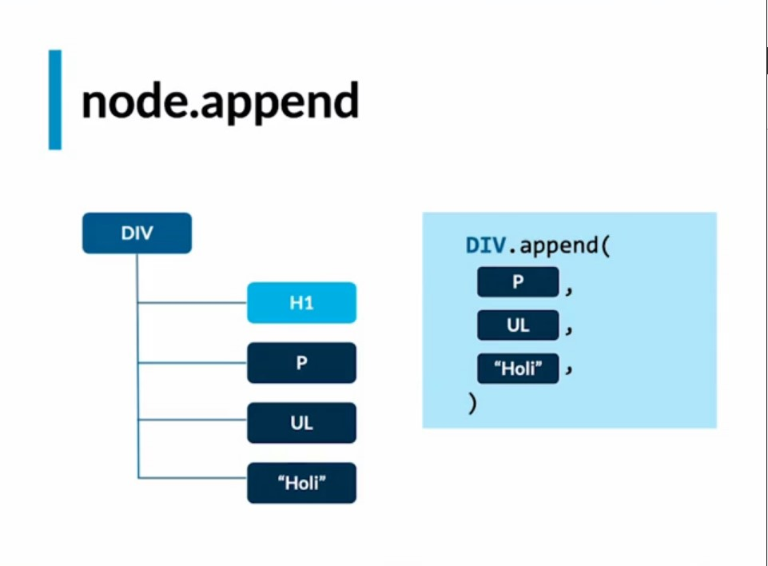
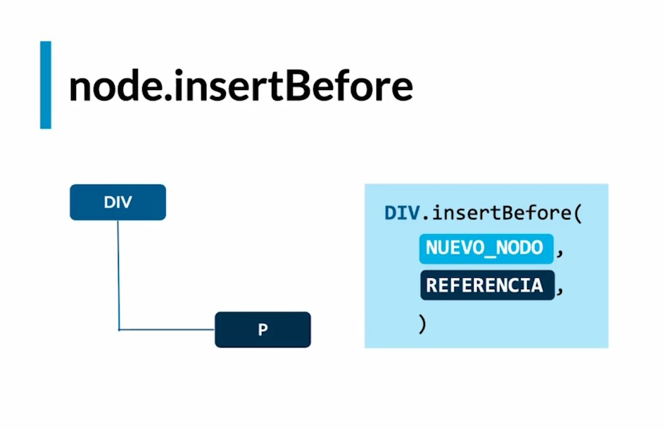
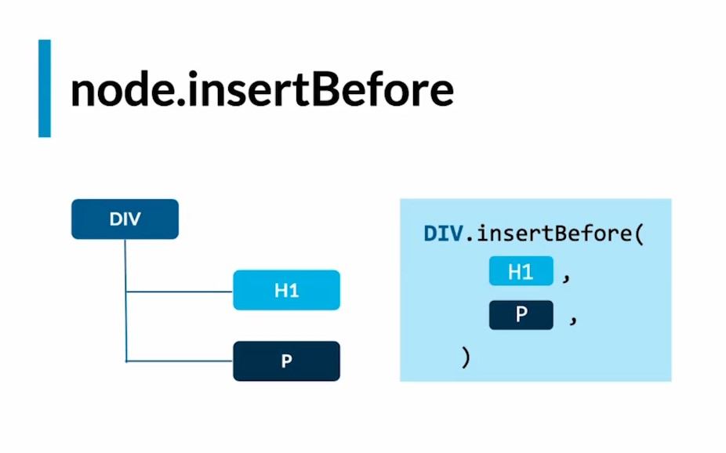
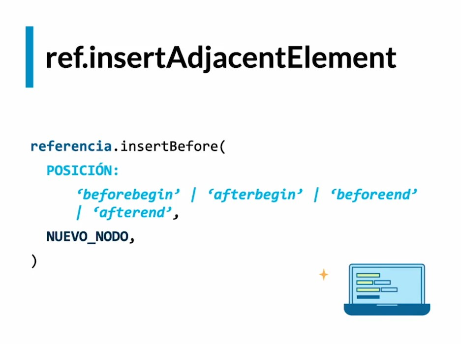
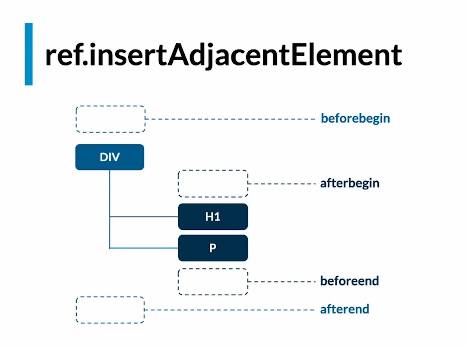

# CRP - CRITICAL RENDER PATH

## RENDER TREE - ÁRBOL DE RENDERIZADO

    El DOM es una representación del HTML en una estructura en forma de árbol de nodos
    El CSSOM es una representación de los estilos en una estructura en forma de árbol de nodos

## WEB API's
    Existen muchas web api's desarrolladas para diferenbtes propósitos como:
        - Animaciones
        - Drag and Drop
        - Transmisiones de video con RTC
        - EventListener en el caso de eventos para JS
        - etc

    En la siguiente página se muestra las api según MDN;
    [https://developer.mozilla.org/es/docs/web/api]

## LECTURA DE NODOS
    - Obtener un elemento por su ID:
    - document.getElementById('id')

    - Obtener elementos mediante el nombre de la etiqueta:
    - document.getElementsByTagName('tagName')

    - Obtener elementos mediante el nombre de clase:
    - document.getElementsByClassName('className')  

    - TANTO DOCUME...BYCLASNAME Y BYTAGNAME devuelven un array
       del tipo HTML COLLECTIONS

    - Selecciona un solo elemento y lo devuelve, la selección se hace a través de lo que
      le pases entre paréntesis, y la selección puede ser con sintaxis de CSS
    - document.querySelector()

    - Obtener varios elementos
    - document.querySelectorAll()

    - QUERYSELECTOR DEVUELVE un NodeList

## NODELISTS VS ARRAY
    - doc.querySelector y querySelectorAll devuelven un Nodelist
    - Un NodeList carece de algunos métodos presentes en los array como:
        - map
        - filter
        - some
        - reduce
    
    - Es más convencional trabajar con Array,ya que los motores de los navegadores 
      estan optimizados para trabajar con Array que con nodeList entonces existe una manera
      de convertir un nodeList en un array mediante el operador de propagación de JS ...
<pre>CONST nodeListTOArray = [...nodelist]</pre>

## CREAR NODOS

  - Para crear elementos:
      document.createElement()
    
  - Para crear textos
      document.createTextNode()

## AGREGAR NODOS

  - Para agregar nodos:

### appendChild()

    - Agrega solo un elemento(nodo) al final del elemento padre.
    - No puedes agregar texto 

      perentElement.appendChild()

### append()

    - La evolución del método appendChild
    - Puedes agregar más de un elemento(nodo) 
    - Puedes agregar texto
    - IE 11: No soportado

      parentElement.append()

### insertBefore()

    - Se agrega el nodo antes de un nodo en espefícico que pasamos por parámetro
    - El nodo de referencia debe ser hijo directo del nodo Base
      parentElement.insertBefore(nodo, nodoDeReferencia)
    

### insertAdjacentElement()

    - Forma avanzada de insertar nodos a partir de una referencia.
    - Permite agregar en diferentes posiciones según le pasemos por parámetro.

      NodoDeREferencia.insertAdjacentElement('parámetro', nodo)

    - Tiene cuatro opciones de agregar el nuevo nodo:

        - beforebegin   : inmediatamente antes de que comienze el nodo de referencia.
        - afterbegin    : como nodo hijo después de que comienze el nodo de referencia.
        - beforeend     : como nodo hijo antes de que termine el nodo de referencia.
        - afterend      : inmediatamente después de que termine el nodo de referencia.

## OTRAS FORMAS DE LEER Y AGREGAR NODOS
<pre>
    <h2>Hola</h2>  
</pre>

### leer: outerHTML
    $0.outerHTML
    "<h2>Hola</h2>"
### lerr: outerText
    $0.outerText
    "Hola"

### escribir: innerHTML
    $0.innerHTML = 'hola2'
<pre>
    <h2>
        hola2
    </h2>  
</pre>
### esribir: innerText
    $0.innerText = 'hola2'
<pre>
    <h2>"hola2"</h2>  
</pre>

    - Esta forma de leer y escribir elementos no es aconsejable
      cuando es el usuario quien va a realizar la accion de escribir
      o cambiar algun contenido por que se generan problemas de seguridad.